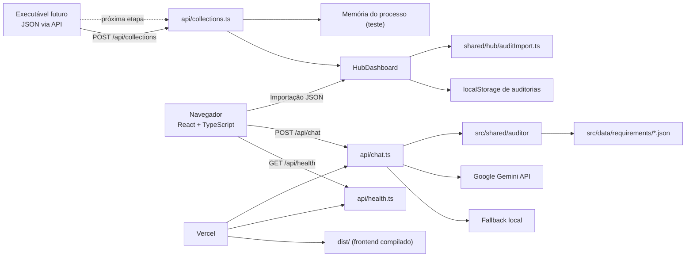

# Arquitetura do Validador Técnico TOTVS Linx

Este documento explica a aplicação do ponto de vista de arquitetura, execução, manutenção e evolução. O texto assume que o leitor conhece Java, mas ainda não domina TypeScript, React, Vite ou funções serverless.

> **Escopo:** esta documentação descreve o estado atual do código. Os requisitos técnicos usados pelo auditor ficam nos arquivos JSON versionados em `src/data/requirements/`.

## 1. Visão geral

O sistema é uma aplicação web que:

1. apresenta um Hub React no navegador;
2. importa um ou vários JSONs de coleta e os organiza em um Kanban por sistema;
3. normaliza os campos do coletor e executa uma auditoria inicial local;
4. apresenta o status e o resultado completo de cada loja;
5. mantém os registros do Hub no `localStorage` do próprio navegador;
6. oferece a Auditoria manual legada por texto, formulário guiado ou imagens;
7. envia o histórico da conversa para `POST /api/chat`;
8. identifica um dos três produtos, monta uma instrução com a matriz correspondente e envia texto/imagens ao Gemini;
9. renderiza a resposta conversacional ou como relatório visual.

Os três produtos reconhecidos são:

- TasteOne PDV;
- TasteOne Autoatendimento;
- Degust PDV.

O navegador não acessa a chave da API do Gemini. A chave fica somente no backend, em `GEMINI_API_KEY`.

## 2. Mapa de arquitetura



Há dois ambientes de execução:

| Ambiente | Frontend | Backend |
|---|---|---|
| Desenvolvimento local | Vite em modo middleware | Express em `server.ts` |
| Produção Vercel | Arquivos estáticos em `dist/` | Funções serverless em `api/` |

O handler de chat é compartilhado: o servidor Express local importa `api/chat.ts`, e a Vercel executa esse mesmo arquivo como função.

A ingestão do executável é feita por `api/collections.ts`. Nesta fase os registros ficam em memória no processo e são consultados pelo Hub através de `GET /api/collections`. O contrato está documentado em `docs/API-COLETA.md`.

## 3. Tecnologias e responsabilidades

### 3.1 JavaScript, TypeScript e JSX/TSX

- **JavaScript** é a linguagem executada pelo navegador e pelo Node.js.
- **TypeScript** adiciona tipos estáticos ao JavaScript.
- **JSX** permite escrever marcação semelhante a HTML dentro de JavaScript.
- **TSX** é TypeScript que contém JSX.

Comparação com Java:

| Java/Java EE | Este projeto |
|---|---|
| Classe e método | Função, componente ou módulo |
| Interface Java | `interface` ou `type` do TypeScript |
| Maven/Gradle | `npm` e `package.json` |
| Servlet/controller | Handler em `api/*.ts` |
| Spring Boot local | Express em `server.ts` |
| Template server-side | Componentes React no navegador |
| DTO | Objetos tipados como `Message` e `AuditMessage` |
| `application.properties` | `.env`/variáveis de ambiente |

TypeScript não é executado diretamente pelo navegador. Em desenvolvimento, `tsx` executa arquivos TypeScript no Node. Em produção, Vite e esbuild transformam o código para JavaScript.

### 3.2 React

React organiza a tela em componentes funcionais. Um componente recebe propriedades (`props`) e pode manter estado com `useState`.

Exemplo conceitual:

```tsx
function Saudacao({ nome }: { nome: string }) {
  return <p>Olá, {nome}</p>;
}
```

Equivalente conceitual em Java: uma classe de apresentação que recebe dados e produz uma representação visual. A diferença importante é que React atualiza a tela de forma reativa quando o estado muda.

Componentes principais:

- `App.tsx`: coordena o estado global da tela e o envio da conversa.
- `Header.tsx`: cabeçalho, menu responsivo e ações de navegação.
- `ChatInterface.tsx`: campo de entrada, cenários rápidos e anexos.
- `ChatMessageBubble.tsx`: bolhas individuais e identificação de relatórios.
- `ReportCard.tsx`: apresentação visual do laudo.
- `SpecBuilderModal.tsx`: formulário guiado.
- `DocumentationDrawer.tsx`: painel de documentação.

### 3.3 Vite

Vite é o servidor de desenvolvimento e o bundler do frontend.

Responsabilidades:

- servir o React localmente;
- transformar TS/TSX;
- aplicar HMR (atualização rápida durante o desenvolvimento);
- gerar `dist/` no build;
- processar CSS e assets;
- permitir imports de JSON e SVG.

O arquivo [vite.config.ts](../vite.config.ts) também contém um middleware para servir mídias específicas de `/public/assets/aistudio/` e ignora PDFs no watcher. A exclusão dos PDFs evita problemas de bloqueio de arquivo no Windows e impede que documentos de requisitos sejam tratados como parte do ciclo normal do frontend.

### 3.4 Express

Express é usado apenas no servidor local. Ele:

- cria a aplicação HTTP;
- interpreta JSON com limite de `512kb`;
- expõe `/api/health`;
- encaminha `POST /api/chat` para o handler compartilhado;
- serve o frontend pelo middleware do Vite em desenvolvimento;
- serve `dist/` quando executado em produção fora da Vercel.

Na Vercel, o `app.listen` não é executado. Cada arquivo dentro de `api/` é tratado como função serverless.

### 3.5 Google Gemini

O pacote `@google/genai` cria o cliente do Gemini no backend. O modelo configurado atualmente é `gemini-3.5-flash-lite`.

O envio contém:

- histórico textual da conversa;
- instrução de sistema construída para o produto escolhido;
- imagens convertidas para `inlineData`;
- temperatura baixa (`0.2`) para favorecer respostas mais consistentes.

### 3.6 Tailwind CSS e Lucide

- **Tailwind CSS** fornece classes utilitárias de layout, cores, espaçamento e responsividade.
- **Lucide React** fornece os ícones usados nos componentes.
- O CSS inicial é carregado em [src/index.css](../src/index.css) com `@import "tailwindcss";`.

### 3.7 npm, tsx e esbuild

O projeto é padronizado em npm:

- `package.json` descreve scripts e dependências;
- `package-lock.json` fixa a árvore de dependências;
- `tsx` executa TypeScript localmente;
- `esbuild` empacota o servidor local para `dist/server.cjs`.

Não se deve adicionar ou manter outro gerenciador de pacotes sem uma decisão explícita. O arquivo de lock oficial é o `package-lock.json`.

## 4. Estrutura de diretórios

```text
.
├── api/
│   ├── chat.ts                         # Função HTTP do auditor
│   └── health.ts                       # Health check
├── documentacao-de-requisitos/
│   ├── requisitos-*.pdf                # Fontes documentais originais
│   └── exemplos-especificacoes-windows/ # Exemplos de capturas
├── public/                             # Arquivos servidos sem processamento
├── src/
│   ├── assets/                         # Logos e favicons de origem
│   ├── components/                     # Componentes React
│   ├── data/
│   │   ├── requirements/               # Fonte operacional estruturada
│   │   ├── linxSpecs.ts                # Dados legados/auxiliares
│   │   └── sampleScenarios.ts          # Cenários rápidos da interface
│   ├── shared/auditor/                 # Regras compartilhadas frontend/backend
│   ├── App.tsx                         # Composição principal
│   ├── main.tsx                        # Bootstrap do React
│   ├── types.ts                        # Tipos da aplicação
│   └── index.css                       # Entrada do Tailwind
├── docs/
│   └── ARQUITETURA.md                  # Este documento
├── server.ts                           # Bootstrap HTTP local
├── index.html                          # HTML inicial do Vite
├── vite.config.ts                      # Configuração do frontend
├── tsconfig.json                       # Configuração TypeScript
├── vercel.json                         # Configuração de build da Vercel
└── package.json                        # Scripts, dependências e versão do Node
```

## 5. Fluxo completo de uma auditoria

### 5.1 Inicialização do frontend

1. `src/main.tsx` encontra o elemento `#root` de `index.html`.
2. React monta `<App />` dentro de `StrictMode`.
3. `App.tsx` tenta restaurar `linx-taste-one:recent-chat` do `localStorage`.
4. Se não existir histórico válido, exibe a saudação inicial.

### 5.2 Envio de texto

1. O usuário digita no `ChatInterface`.
2. `App.handleSendMessage` cria uma mensagem com `role: "user"`.
3. A mensagem é adicionada ao estado React.
4. O histórico é convertido para o payload JSON.
5. O navegador executa `fetch("/api/chat", { method: "POST" })`.
6. A resposta `reply` vira uma nova mensagem do assistente.
7. React renderiza a nova bolha.
8. O `useEffect` salva o histórico atualizado no `localStorage`.

### 5.3 Envio de imagens

1. O usuário seleciona PNG, JPEG ou WebP.
2. `ChatInterface` lê o arquivo com `FileReader`.
3. A imagem é desenhada em um `canvas`.
4. É reduzida para no máximo 1280 pixels no maior eixo e convertida para JPEG.
5. A mensagem guarda `name`, `mimeType` e `dataUrl`.
6. O payload envia a imagem somente naquela conversa.
7. O backend converte o Data URL em base64 e cria:

```ts
{
  inlineData: {
    mimeType: "image/jpeg",
    data: "..."
  }
}
```

8. O Gemini interpreta a imagem de acordo com a instrução do produto escolhido.

O projeto aceita até três imagens por mensagem. Cada imagem tem limite de aproximadamente 1 MB e o conjunto da mensagem tem limite de aproximadamente 3 MB. A validação rejeita tipos não permitidos, Data URLs inválidos, mensagens excessivas e imagens acima dos limites.

### 5.4 Seleção do produto

`detectSystems` concatena as mensagens do usuário e procura os nomes dos sistemas.

Regras:

- zero sistemas: o backend pede a seleção;
- mais de um sistema: o backend pede uma escolha única;
- exatamente um sistema: a auditoria pode prosseguir.

Esta seleção ocorre antes da chamada ao Gemini. Portanto, o prompt enviado contém apenas a matriz do produto escolhido.

### 5.5 Montagem do prompt

`buildSystemInstruction(system)`:

1. obtém o JSON com `getRequirements`;
2. serializa a matriz do produto;
3. adiciona regras de coleta;
4. explica como interpretar imagens;
5. define os bloqueios de rede;
6. exige a estrutura de relatório em `REPORT_FORMAT`.

Essa é a fronteira entre dados de negócio e integração com o modelo. Para mudar requisitos, prefira editar os JSONs. Para mudar o comportamento geral do auditor, altere `buildPrompt.ts`.

### 5.6 Fallback

Se `GEMINI_API_KEY` não existir ou a chamada ao Gemini falhar:

1. o erro é registrado no backend;
2. `fallbackResponse` analisa o texto acumulado;
3. `missingInfrastructureFields` identifica dados ausentes;
4. o usuário recebe uma resposta local.

O fallback não interpreta imagens. Se a única informação estiver em uma imagem, a aplicação deve informar ao usuário que uma confirmação textual pode ser necessária quando o Gemini estiver indisponível.

## 6. Contratos de dados

### 6.1 Mensagem do frontend

O tipo visual está em `src/types.ts`:

```ts
interface Message {
  id: string;
  role: "user" | "assistant";
  content: string;
  timestamp: string;
  images?: ImageAttachment[];
}
```

O backend usa uma versão sem `id` e `timestamp`:

```ts
type AuditMessage = {
  role: "user" | "assistant";
  content: string;
  images?: ImageAttachment[];
};
```

Essa separação é intencional: o servidor precisa apenas do conteúdo da conversa, enquanto `id` e `timestamp` são detalhes de apresentação.

### 6.2 `POST /api/chat`

Requisição:

```json
{
  "messages": [
    {
      "role": "user",
      "content": "Vou utilizar o TasteOne PDV."
    }
  ]
}
```

Resposta de sucesso:

```json
{
  "reply": "Texto gerado pelo auditor."
}
```

Resposta de fallback:

```json
{
  "reply": "Para emitir o diagnóstico, ainda faltam...",
  "isFallback": true,
  "warning": "O serviço de IA está temporariamente indisponível..."
}
```

Erros:

- `405`: método diferente de POST;
- `400`: mensagens ausentes, inválidas ou acima dos limites;
- `500`: não é o comportamento esperado para indisponibilidade do Gemini; falhas do modelo devem cair no fallback.

### 6.3 `GET /api/health`

Exemplo:

```json
{
  "status": "ok",
  "hasApiKey": true,
  "timestamp": "2026-09-14T14:00:00.000Z"
}
```

`hasApiKey` informa apenas se a variável existe. A chave nunca é retornada.

## 7. Fonte de requisitos

Cada JSON representa uma matriz operacional:

```json
{
  "system": "TasteOne PDV",
  "version": "2026.09",
  "windows": {},
  "android": {},
  "network": {},
  "homologatedDevices": []
}
```

Os arquivos atuais são:

- [tasteone.json](../src/data/requirements/tasteone.json)
- [tasteone-autoatendimento.json](../src/data/requirements/tasteone-autoatendimento.json)
- [degust.json](../src/data/requirements/degust.json)

### Atualizando um requisito

1. confirme a mudança na documentação oficial;
2. edite somente o JSON correspondente;
3. atualize o campo `version`;
4. valide a sintaxe JSON;
5. execute `npm.cmd run lint`;
6. execute `npm.cmd run build`;
7. teste pelo menos um cenário aprovado e um reprovado;
8. publique a alteração.

Não coloque os PDFs dentro do prompt e não leia os PDFs por requisição. O JSON é a fonte carregada pelo bundler e reutilizada durante a execução.

## 8. Persistência e privacidade

O histórico usa:

```text
linx-taste-one:recent-chat
```

Características:

- armazenamento por navegador e por origem;
- sem contas;
- sem banco de dados;
- perdido se o usuário limpar os dados do site;
- imagens anexadas podem ser persistidas temporariamente como Data URLs junto com o histórico;
- a chave Gemini não fica no navegador.

Ao clicar em “Nova Auditoria”, o histórico é removido.

### Atenção operacional

Imagens em base64 ocupam bastante espaço. Se futuramente o histórico crescer demais, as opções são:

1. não persistir imagens, mantendo apenas texto e miniatura temporária;
2. limitar o número de mensagens armazenadas;
3. usar IndexedDB;
4. criar persistência autenticada no backend.

## 9. Desenvolvimento local

### Pré-requisitos

- Node.js 20 ou superior;
- npm;
- chave válida do Gemini para respostas com IA.

### Instalação

```powershell
npm.cmd install
Copy-Item .env.example .env
```

Edite `.env`:

```text
GEMINI_API_KEY=sua_chave
```

Nunca faça commit de `.env`.

### Execução

```powershell
npm.cmd run dev
```

O servidor Express local fica em `http://localhost:3000`. O Vite é conectado como middleware e entrega a interface React.

### Validação

```powershell
npm.cmd run lint
npm.cmd run build
npm.cmd run preview
```

No PowerShell deste ambiente, use `npm.cmd` em vez de `npm` quando o script PowerShell do npm estiver bloqueado.

## 10. Build de produção

O script `build` executa duas etapas:

```text
vite build
esbuild server.ts --bundle --platform=node --format=cjs --packages=external ...
```

Resultado:

- `dist/index.html` e assets: frontend estático;
- `dist/server.cjs`: servidor local empacotado;
- sourcemaps: apoio à depuração.

A Vercel utiliza `npm run build`, publica `dist/` e detecta as funções de `api/`.

## 11. Deploy na Vercel

1. publique o repositório no GitHub;
2. importe o repositório na Vercel;
3. mantenha o comando de instalação como `npm install`;
4. configure `GEMINI_API_KEY` em Preview, Development e Production;
5. faça o deploy;
6. teste:

```text
https://SEU_DOMINIO.vercel.app/
https://SEU_DOMINIO.vercel.app/api/health
```

O endpoint `/api/chat` exige POST. Abrir sua URL diretamente no navegador faz um GET e deve retornar “Método não permitido”.

## 12. Como manter cada área

### Mudança visual

Normalmente envolve:

- `src/components/*.tsx`;
- classes Tailwind;
- `src/types.ts`, se o formato visual mudar.

Não coloque chamada ao Gemini dentro de componentes React. A UI deve chamar `onSendMessage`.

### Mudança de requisitos

Edite `src/data/requirements/*.json` e, se necessário, atualize `buildPrompt.ts`.

### Mudança na API

Edite `api/chat.ts`. Lembre que o mesmo handler é usado localmente por `server.ts`.

### Mudança do fallback

Edite:

- `src/shared/auditor/fallbackResponse.ts`;
- `src/shared/auditor/validateInfrastructure.ts`.

O fallback deve continuar útil quando não houver chave ou quando o provedor estiver indisponível.

### Mudança do formato do relatório

Edite [reportFormat.ts](../src/shared/auditor/reportFormat.ts) e confirme que [ReportCard.tsx](../src/components/ReportCard.tsx) ainda reconhece os títulos. Os títulos principais funcionam como um contrato entre o texto produzido pelo modelo e a interface.

## 13. Pontos de atenção para manutenção

### 13.1 Modelo generativo não é determinístico

Mesmo com temperatura baixa, respostas podem variar. A estrutura do relatório, os requisitos e os bloqueios importantes devem ser reforçados por código sempre que possível.

### 13.2 O texto do modelo não substitui validação de segurança

O backend valida formato, tamanho e tipo de imagem. Ele não deve aceitar comandos enviados pelo modelo para alterar requisitos, revelar a chave ou ignorar regras.

### 13.3 Imagens são evidências, não treinamento

As imagens anexadas pelo usuário são enviadas para a consulta atual. Os exemplos de Windows no repositório não são incluídos automaticamente em toda requisição.

### 13.4 Dados legados

`src/data/linxSpecs.ts` pode conter dados históricos ou auxiliares da interface. A matriz operacional atual é `src/data/requirements/`. Antes de remover um arquivo legado, pesquise todas as referências no projeto.

### 13.5 Configuração de tipo

O TypeScript está configurado com `noEmit: true`: o comando `lint` verifica tipos, mas não gera JavaScript. A geração ocorre no Vite/esbuild.

## 14. Roteiro de depuração

### A tela não abre

1. execute `npm.cmd run dev`;
2. confira se a porta 3000 está livre;
3. leia o terminal do `tsx`;
4. execute `npm.cmd run lint`.

### `/api/health` retorna erro

1. confira se o servidor está em execução;
2. teste `http://localhost:3000/api/health`;
3. confirme `.env`;
4. em produção, consulte os logs da função Vercel.

### `/api/chat` retorna método não permitido

Isso é esperado quando a URL é aberta diretamente no navegador. Use uma requisição POST com JSON.

### O modelo pede o sistema novamente

Verifique se o texto contém exatamente um dos nomes reconhecidos por `detectSystems`. Se o usuário mencionar dois produtos, a aplicação bloqueia a comparação ambígua.

### O relatório não aparece como cartão

Verifique:

1. se a resposta contém `Diagnóstico de Viabilidade Técnica`;
2. se contém `Status Geral:`;
3. se os títulos de hardware, rede e plano de ação foram preservados;
4. se `ChatMessageBubble.tsx` identifica a resposta;
5. se `ReportCard.tsx` espera os mesmos títulos.

### A imagem não é aceita

Confira formato, quantidade e tamanho. A seleção converte a imagem para JPEG, mas o payload final precisa permanecer dentro dos limites do backend e da plataforma.

## 15. Checklist antes de publicar

- [ ] requisitos JSON revisados e versionados;
- [ ] nenhum segredo em arquivos rastreados;
- [ ] `npm.cmd run lint` aprovado;
- [ ] `npm.cmd run build` aprovado;
- [ ] `/api/health` funcionando;
- [ ] seleção de sistema testada;
- [ ] cenário com dados faltantes testado;
- [ ] cenário aprovado e reprovado testados;
- [ ] formulário guiado testado;
- [ ] imagem técnica testada;
- [ ] fallback testado sem `GEMINI_API_KEY`;
- [ ] relatório visual preservado;
- [ ] deploy testado com POST real para `/api/chat`.

## 16. Glossário rápido para quem vem do Java

- **Componente:** unidade visual React, semelhante a uma classe de tela pequena.
- **Hook:** função especial do React para estado e ciclo de vida, como `useState` e `useEffect`.
- **Props:** parâmetros recebidos por um componente.
- **Estado:** dados que, quando mudam, provocam nova renderização.
- **Handler:** função que processa uma requisição HTTP.
- **Serverless:** função executada sob demanda pela plataforma, sem um servidor permanentemente gerenciado pelo projeto.
- **Bundler:** ferramenta que reúne módulos e assets para execução.
- **Transpilação:** transformação de TypeScript/JSX em JavaScript executável.
- **Data URL:** representação de um arquivo dentro de uma string, usada aqui para transportar imagens em base64.
- **Fallback:** comportamento alternativo quando o serviço principal não está disponível.
- **Matriz de requisitos:** JSON estruturado que representa os critérios técnicos de um produto.
- **HMR:** atualização da aplicação no navegador sem reiniciar manualmente o servidor durante o desenvolvimento.
